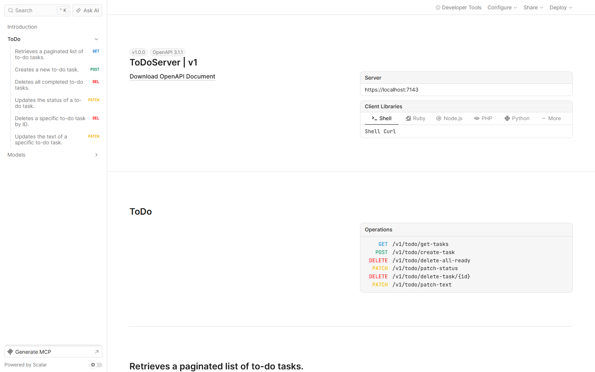
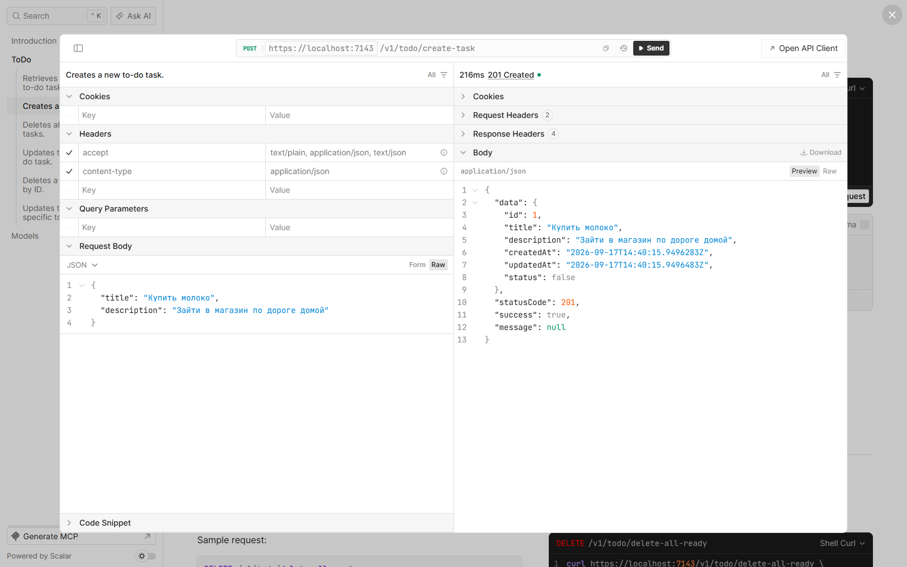

# ToDo Server

REST API для списка задач на ASP.NET Core: пагинация, фильтр по статусу, CRUD, массовое удаление завершённых. Сделал как учебный проект, чтобы закрепить слоистую архитектуру (Controller → Service → Repository) на чистом примере без лишней предметной области.



## Что умеет

- Список задач с пагинацией и фильтром по статусу (`GET /v1/todo/get-tasks`)
- Создание задачи с валидацией длины и обязательности заголовка
- Изменение статуса и текста задачи по отдельности (`PATCH`)
- Удаление одной задачи и массовое удаление всех завершённых
- Интерактивная документация API на Scalar: можно сразу отправить запрос из браузера



## Стек

.NET 10 · ASP.NET Core Web API · EF Core 10 (Npgsql) · PostgreSQL · Scalar (OpenAPI)

## Запуск

Нужен PostgreSQL. Проще всего поднять его контейнером:

```bash
docker run -d --name todo-pg -e POSTGRES_USER=postgres -e POSTGRES_PASSWORD=postgres -e POSTGRES_DB=todo -p 5432:5432 postgres:16-alpine
```

Строка подключения указывается в `appsettings.Development.json` (в репозитории её нет, создайте сами):

```json
{
  "ConnectionStrings": {
    "ToDoContext": "Host=localhost;Database=todo;Username=postgres;Password=postgres"
  }
}
```

```bash
dotnet run
```

В Development-режиме миграции применяются автоматически при старте. API работает на `http://localhost:5080`, документация доступна на `/scalar/v1`.

## Архитектура

- Controller → Service → Repository, каждый слой отвечает только за свою зону: контроллер не знает про EF Core, репозиторий не знает про DTO
- Обновления и удаления идут через `ExecuteUpdateAsync`/`ExecuteDeleteAsync`, без лишней загрузки сущности в память там, где она не нужна
- Единая обёртка ответа (`BaseSuccessResponse<T>` / `CustomSuccessResponse<T>`) вместо произвольных форматов на каждый эндпоинт

## Статус

Рабочий: собирается, поднимается, миграции применяются, все эндпоинты проверены вручную через Scalar и curl (включая кириллицу). Автотестов нет.
